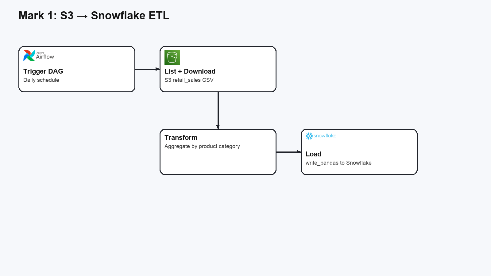

# Mark 1: S3 to Snowflake DAG

This DAG (`S3_To_Snowflake`) pulls a retail sales CSV from S3, summarizes sales by product category with pandas, and loads the results into Snowflake. It runs on a daily schedule and truncates the target table before loading new aggregates.

**How it works**
- **List + download**: finds CSV files under the `retail_sales/` prefix in S3 and downloads the latest file.
- **Transform**: reads the CSV into pandas and aggregates total amount by product category.
- **Load**: truncates `SALES_BY_CATEGORY` and loads the aggregated data with `write_pandas`.

**Configuration**
- AWS credentials are read from environment variables, and the DAG assumes a role via `AWS_ROLE_ARN`.
- Snowflake credentials are read from environment variables like `SNOWFLAKE_USER`, `SNOWFLAKE_PASS`, `SNOWFLAKE_ACCT`, `SNOWFLAKE_VWH`, and `SNOWFLAKE_DB`.

**Flow**

