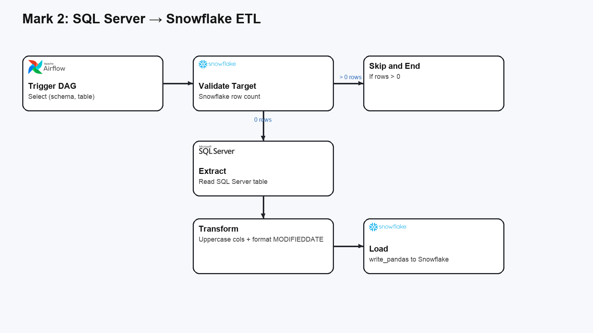

# Mark 2: SQL Server to Snowflake DAG

This DAG (`sqlserver_to_snowflake`) moves a selected table from a local SQL Server instance into a Snowflake database. It is parameter-driven: at trigger time you choose a `(schema, table)` pair discovered from SQL Server, and the DAG checks if the destination table in Snowflake is empty before loading. If data already exists, the DAG skips the load path.

**How it works**
- **Discover & select table**: builds a list of SQL Server schema/table pairs for the DAG parameter.
- **Validate destination**: checks Snowflake for row count of the chosen table; if non‑zero, the DAG ends early.
- **Extract & load**: reads the full source table into pandas, normalizes column names, formats `MODIFIEDDATE`, and loads via `write_pandas`.

**Configuration**
- SQL Server connection values are read from environment variables like `SQLSERVER_HOST`, `SQLSERVER_DB`, `SQLSERVER_USER`, and `SQLSERVER_PASS`.
- Snowflake credentials are read from environment variables like `SNOWFLAKE_USER`, `SNOWFLAKE_PASS`, `SNOWFLAKE_ACCT`, `SNOWFLAKE_VWH`, and `SNOWFLAKE_DB`.

**Flow**

