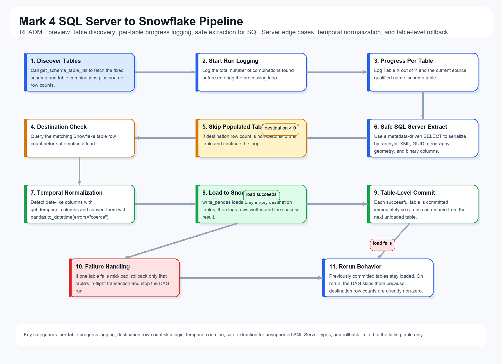

# Mark 4: SQL Server to Snowflake All Tables DAG

**Full disclosure : Completely AI generated DAG.**

This DAG (`sqlserver_to_snowflake_all_tables`) loads all approved AdventureWorks tables from the local SQL Server instance into their matching Snowflake tables. Unlike Mark 2, it does not take any user input at trigger time. Instead, it uses `get_schema_table_list` from the shared `etl.mssql` package to fetch the exact schema and table combinations that should be processed on each run.

## Run Behavior

At the start of the run, the DAG logs the total number of schema/table combinations discovered by `get_schema_table_list`. It then processes the list one table at a time and writes clear progress details to the audit log for every iteration, including:
- `Table X out of Y`
- the current qualified source table name (`schema_name.table_name`)
- the source row count
- the destination Snowflake row count
- whether the table was loaded or skipped

A table is loaded only when the corresponding Snowflake destination table has a row count of zero. If rows already exist, that table is skipped. This makes reruns straightforward because previously loaded tables are naturally ignored and the DAG resumes from the first remaining empty destination table.

## Load Safeguards

To avoid SQL Server extraction failures, the DAG uses a metadata-driven SELECT query instead of a raw `SELECT *`. This safely serializes unsupported source column types such as `hierarchyid`, `xml`, `uniqueidentifier`, `geography`, `geometry`, and binary-style columns before pandas reads the result set.

The DAG also applies the same temporal-column handling as Mark 2. It calls `get_temporal_columns` to identify date-like source columns, converts them with `pandas.to_datetime(errors="coerce")`, and logs any values that are coerced to null before loading into Snowflake with `write_pandas`.

## Failure Handling

Each table load is committed independently in Snowflake. If a table fails while loading, the DAG rolls back only that table's in-flight transaction and then stops the run. Previously committed tables remain loaded, which prevents unnecessary rework and allows the next run to continue from the first table that still has zero rows in Snowflake.

## Flow Diagram

